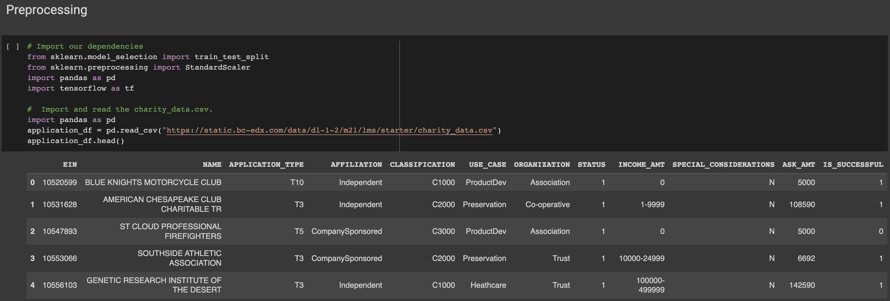
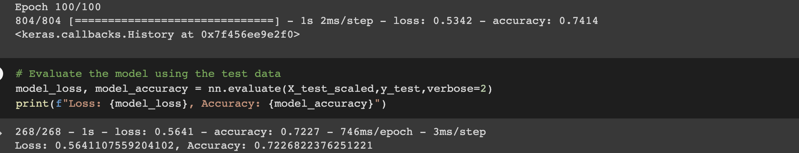

# deep-learning-abc: Neural Network Model Report
**Overview** 
-
This purpose of this project is to create and optimize a Neural Network model for the non-profit foundation Alphabet Soup. The foundation wants a tool that can select applicants that have the highest chance of succces. The data used to test and train the model comes from a CSV containing over 34,000 organizations that have recieved funding from Alphabet soup

**Results**
-
**Preprocessing:**

* The target variables for the model are the variables we want to predict (aka dependent variables). In this case the target variable is the binary variable "IS_SUCCESSFUL" in our data set;  1 indicates positive or success class and 0 is negative or failure class. 

* The features are the remaining columns, which we can describe as the independent variables we want to use to help us predict success/ In this case, the feature variables were "APPLICATION_TYPE", "AFFILIATION", "CLASSIFICATION", "CLASSIFICATION", "USE_CASE", "ORGANIZATION", "INCOME_AMT", "SPECIAL_CONSIDERATIONS", and "ASK_AMT".

* "EIN" and "NAME" can be removed from the input data as they are identifer columns which are neither target nor feature variables. Additionally, when optimizing my model, I chose to remove "STATUS" as well, since a binary variable that says whether an organization is  active or not probably will not help the model predict whether they are successful or not. Additionally, when I checked the distrubtion of the data with a histogram, I saw that the vast majority of organizations were identifed in the positive class, meaning most of organizations in the data set are currently active

**Compiling, Training, and Evaluating the Model:**
* In my final optimized model, I used 3 hidden layers and 1 output layer. The number of neurons in each hidden layer is 130, 60, and 25, respectively. The activation function used for all hidden layers is tanh, and the output layer has the sigmoid activation function. Choosing the number of layers required some experimentation but I chose to increase the number because in general deeper neural networks with more neurons per layer tend to perform better in terms of accuracy. I also did some experimentation with activation functions and though that using the tanh activation function might help the model capture non-linear relationships between input features and the target variable. I chose the sigmoid activiation function for the output layer because it seems to be a good choice for binary classification problems. 

* Though I was not able to able to reach the target performance of 75% accuracy, I was able to improve my model through optimization and get the training data accuracy up to 74.25% and the test data accuracy at 72.5%

*Before optimization:*

*After optimization:*

* Steps I took to increase model performance include dropping more columns, decreasing the number of values in the classification bin, adding more neurons to hidden layers, adding another hidden layer, and using different activation functions on the hidden layer. 

**Summary**
-
The model was trained for 100 epochs with a batch size of 804. The training accuracy of the model is 0.7425 (74.25%) and the loss is 0.5307.

The model was then evaluated on the test data, and the accuracy is found to be 0.7250 (72.50%) with a loss of 0.5599. This indicates that the model is not overfitting, as the accuracy on the test data is not significantly lower than the accuracy on the training data. 

I would reccomend a different model might make use of the of the Keras AutoOptimizer to automatically tune the hyperparameters of the model thereby optimizing model architecture and acheiving higher accuracy and lower loss.
